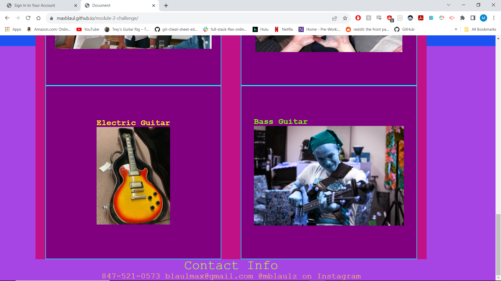
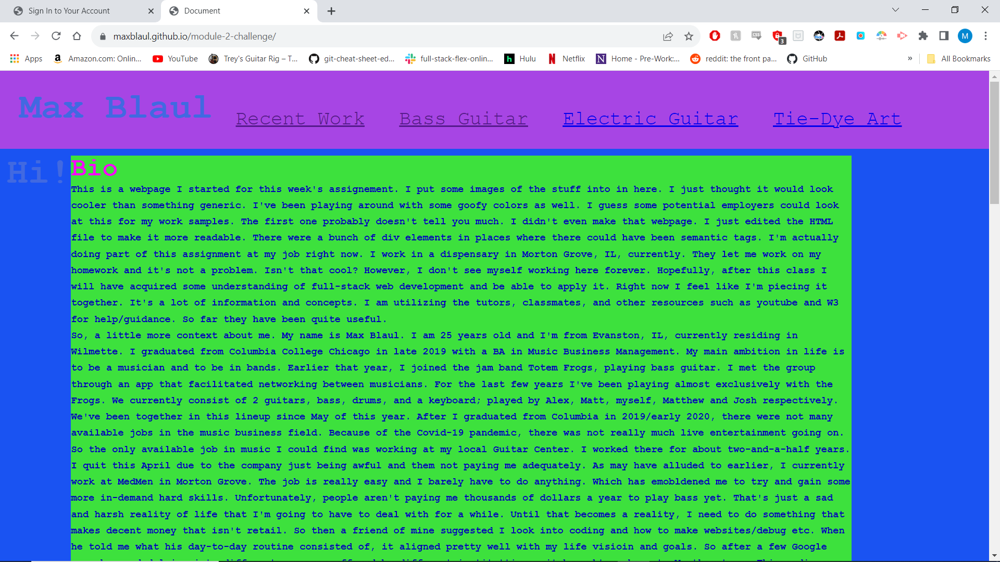

# module-2-challenge
This is the repo for module 2 challenge assignment
For this assignment I had to make a webpage from scratch using HTML and CSS. It is supposed to be a portfolio for work but I only really have one assignment so far. So I took a screenshot of what it looked like and added it onto one of the cards. I did make that webpage, only edited the semantic tags really. There are still some changes I have to make to this document. I have to make a hover, and i also want to change some of the colors so they make sense. I did my best to make it somewhat like the mockup but I had to take some creative liberties with the images and the bio. I also just wanted to experiment with what certain elements, tags, and classes do to the page. Definitely a good excercise in getting familiar with the languages. 

second time sending it in. Changed some colors, made things looks more readable. Added a hover, color change. I had to look up the CSS on how to make it change colors the way I wanted it to. ChatGPT was actually able to point me in the right direction. Basically what I did was define how many boxes I needed and then decided which boxes had to be parents and children of each other. Color coordinating them early on really helped a lot. It could illustrate the relationships and structure a lot better. !
Link and screenshots below.
https://maxblaul.github.io/module-2-challenge/

